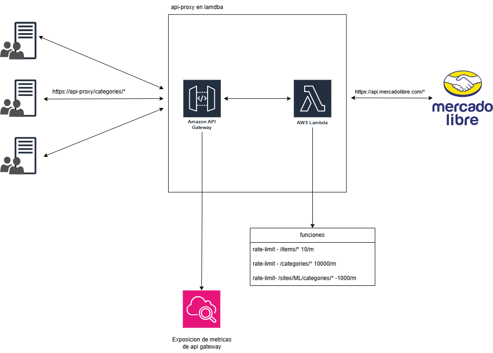

# api-proxy-aws
## Funcionalidad y Features

Este desarrollo proporciona un proxy de API robusto y escalable para interactuar con la API de Mercado Libre. Sus principales funcionalidades y características incluyen:


* **Rate Limiting Basado en Rutas:** Implementa un sistema de limitación de requests configurable basado en los patrones de las rutas solicitadas. Esto ayuda a proteger la API de Mercado Libre y a garantizar un uso justo del servicio.
* **Despliegue en AWS:** Diseñado para ser desplegado en la infraestructura de  (AWS) utilizando servicios serverless como AWS Lambda y API Gateway.
* **Infraestructura como Código con Terraform:** La creación y gestión de la infraestructura en AWS se automatiza mediante Terraform, lo que permite un despliegue consistente y reproducible.
* **Pruebas Unitarias:** Se incluyen pruebas unitarias para verificar la correcta implementación de la lógica de rate limiting, asegurando la fiabilidad del proxy.
* **Entorno de Desarrollo Local con Docker:** Se proporciona un entorno de desarrollo local utilizando Docker, lo que facilita la prueba y el desarrollo del proxy sin necesidad de desplegarlo en AWS.
* **Escalabilidad Automática:** La escalabilidad del proxy está gestionada por AWS API Gateway, que puede ajustarse dinámicamente para manejar diferentes niveles de tráfico.
* **Restricciones por IP:** Se utiliza un array de ip's para definir aquellas permitidas, utilizando el rate-limit para dichas ip's. Por otro lado, si no esta en la lista o explicitamente existe en la lista de ip's denegadas, el proxy debe retornar 403 - Forbidden
* **Configuración Flexible de Límites:** Los límites de requests para diferentes rutas se definen en un diccionario, lo que permite una fácil modificación y adaptación a diferentes necesidades.
* **Registro de Solicitudes:** La función Lambda incluye logging básico para facilitar la monitorización y la depuración del proxy. 
* **Exposicion de metricas:** Las metricas son expuestas por el propio AWS API Gateway. Se pueden consumir con cloudwatch. [CloudWatch](https://docs.aws.amazon.com/apigateway/latest/developerguide/metrics_dimensions_view_in_cloud_watch.html).


### Diagrama de arquitectura
Enlace a diagrama en Draw.io [API-proxy](https://viewer.diagrams.net/?tags=%7B%7D&lightbox=1&highlight=0000ff&edit=_blank&layers=1&nav=1&dark=auto#G1Z2xuJuKynGVkD0Pps90aQWFyK2bARxaA)

Version preliminar:
.
### Uso con Docker para Pruebas locales 

El `Dockerfile` ya está desarrollado para contener la aplicación. Para utilizarlo con el script `main.py` para desarrollo local:

1.  **Construye la imagen de Docker:** Navega al directorio raíz del proyecto (donde se encuentra el `Dockerfile`) y ejecuta el siguiente comando:

    ```bash
    docker build -t api-proxy .
    ```

    Esto construirá una imagen de Docker llamada `api-proxy` utilizando el `Dockerfile` en el directorio actual.

2.  **Ejecuta el contenedor de Docker:** Una vez que la imagen se haya construido, puedes ejecutar un contenedor basado en esa imagen, exponiendo el puerto donde se ejecuta `main.py` (por defecto el puerto 8080):

    ```bash
    docker run -p 8080:8080 api-proxy
    ```

    Este comando ejecutará un contenedor y mapeará el puerto 8080 de tu máquina local al puerto 8080 del contenedor.

3.  **Accede al proxy localmente:** Ahora puedes enviar solicitudes HTTP al proxy localmente a través de `http://localhost:8080`. El script `main.py` actuará como un servidor web que invoca la función `lambda_handler` con la solicitud recibida. Por ejemplo:

    ```bash
    curl http://localhost:8080/sites/MLA/categories
    ```
